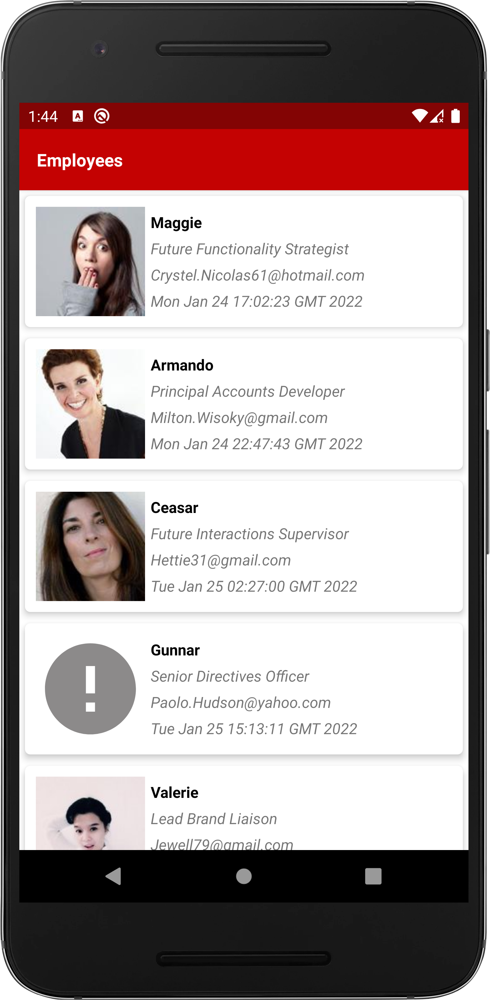
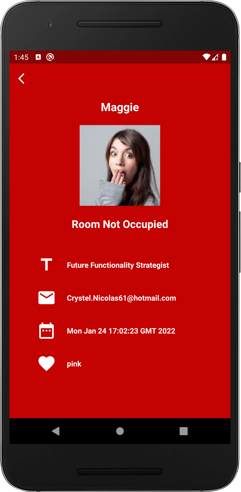

## Development Tools and Dependency

1. Android Studio bumblebee 2021.1.1
2. Target SDK = 31
3. Minimum SDK = 19
4. Dagger Hilt for dependency injection
5. Retrofit for Network API calls 
6. Junit4 unit test 
7. Expresso 
8. JetPack Navigation component for fragments
9. MVVM archi
10. Glide for image loading for list screen and detail screen
11. LiveData with ViewModel LifeCycle

# EmployeeApp

